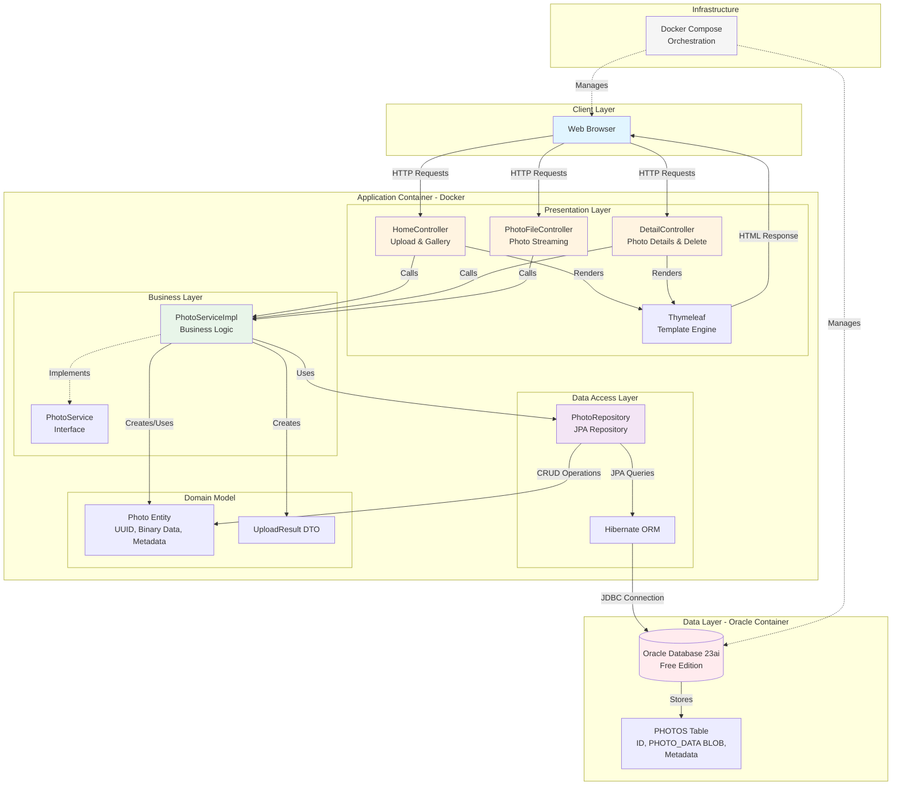
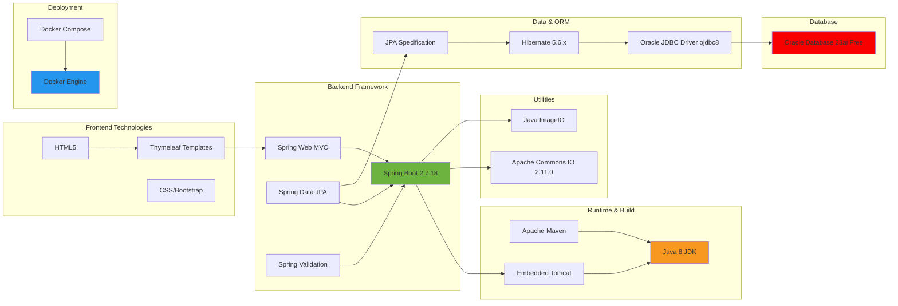
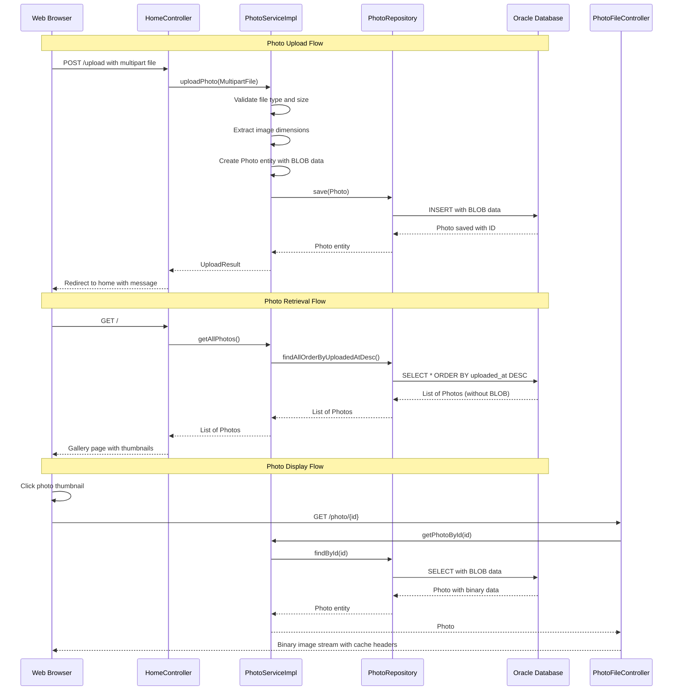
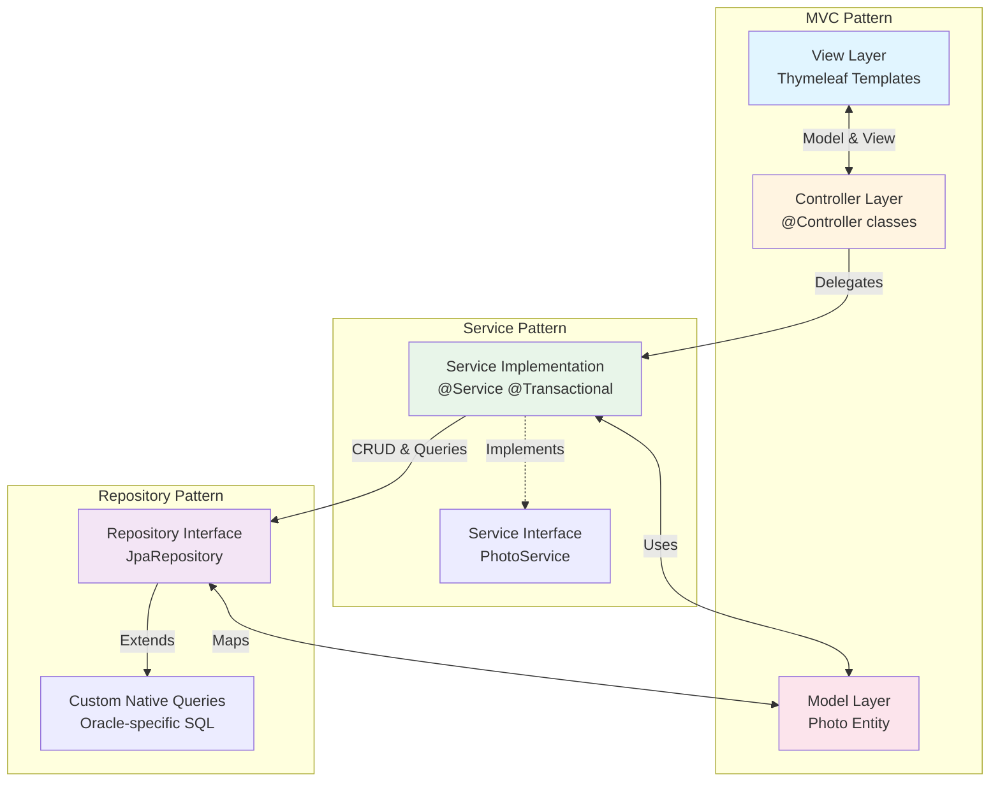
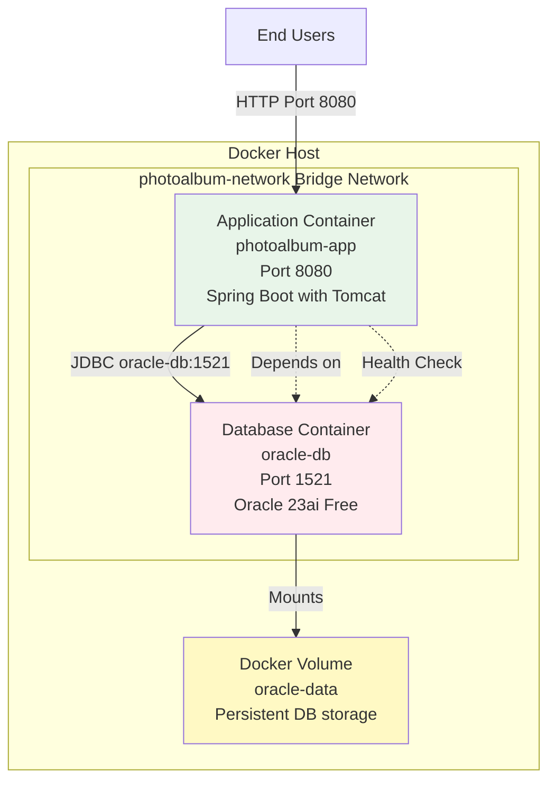
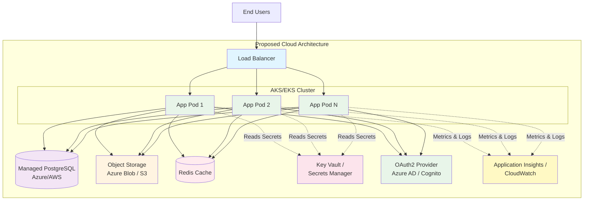

# PhotoAlbum Application Architecture Diagram

**Generated:** 2026-02-11  
**Application:** Photo Album  
**Version:** 1.0.0  
**Framework:** Spring Boot 2.7.18  
**Language:** Java 8  

---

## Application Architecture Overview

---

## Technology Stack

---

## Data Flow Diagram

---

## Component Relationships

---

## Deployment Architecture

---

## Security & Configuration Notes

**⚠️ Current Security Status:**
- ❌ No authentication or authorization
- ❌ All endpoints publicly accessible
- ❌ No Spring Security dependency
- ❌ Database credentials in application.properties

**Configuration:**
- Profiles: default, docker, test
- Database: Oracle with Hibernate auto-DDL (ddl-auto=create in docker profile)
- File Upload: Max 5MB per file, image/* MIME types only
- JVM Settings: Xmx512m, Xms256m

---

## Key Dependencies

| Dependency | Version | Purpose |
|------------|---------|---------|
| Spring Boot | 2.7.18 | Application framework |
| Spring Data JPA | (inherited) | Data access |
| Hibernate | 5.6.x | ORM implementation |
| Oracle JDBC | ojdbc8 | Database driver |
| Thymeleaf | (inherited) | Template engine |
| Commons IO | 2.11.0 | File utilities |
| H2 Database | (test) | In-memory testing |

---

## Architecture Patterns Applied

1. **MVC (Model-View-Controller)**: Separation of presentation, business logic, and data
2. **Service Layer Pattern**: Business logic encapsulation with @Service
3. **Repository Pattern**: Data access abstraction with Spring Data JPA
4. **DTO Pattern**: UploadResult for data transfer
5. **Dependency Injection**: Spring's IoC container for component wiring
6. **Transaction Management**: @Transactional for database operations

---

## Identified Architecture Issues

### Critical
- 🔴 **No Security Layer**: Missing authentication and authorization
- 🔴 **Java 8 EOL**: Runtime version reached end of life
- 🔴 **Database Schema Management**: ddl-auto=create drops data on restart

### High
- 🟠 **BLOB Storage**: Photos stored in database, not scalable
- 🟠 **Spring Boot 2.7**: End of support reached
- 🟠 **Hardcoded Config**: Credentials in properties files

### Medium
- 🟡 **Oracle-Specific SQL**: Reduces database portability
- 🟡 **No Health Checks**: Missing Actuator endpoints
- 🟡 **No Structured Logging**: Console output only

---

## Modernization Architecture Target

---

## Summary

**Current State:**
- Traditional monolithic Spring Boot application
- MVC architecture with clear layer separation
- Docker containerized but not cloud-optimized
- Single Oracle database with BLOB storage
- No security, limited observability

**Strengths:**
- ✅ Clean architecture with proper separation of concerns
- ✅ Already containerized with Docker
- ✅ Stateless application design
- ✅ Standard Spring Boot patterns

**Modernization Needs:**
- Upgrade runtime (Java 17, Spring Boot 3.x)
- Implement security (Spring Security + OAuth2)
- Migrate to cloud object storage
- Add observability (metrics, logs, tracing)
- Externalize configuration
- Replace Oracle-specific queries

**Recommended Next Steps:**
1. Review comprehensive assessment report (report.json)
2. Plan modernization in phases (see assessment report)
3. Start with critical security and runtime updates
4. Gradually migrate to cloud-native services
