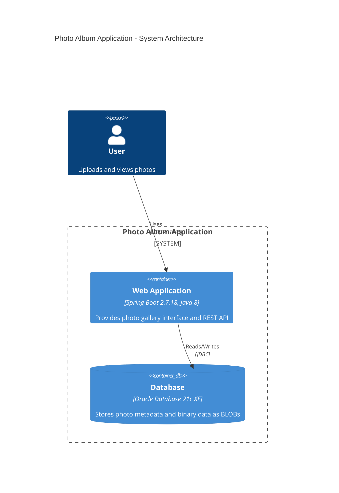
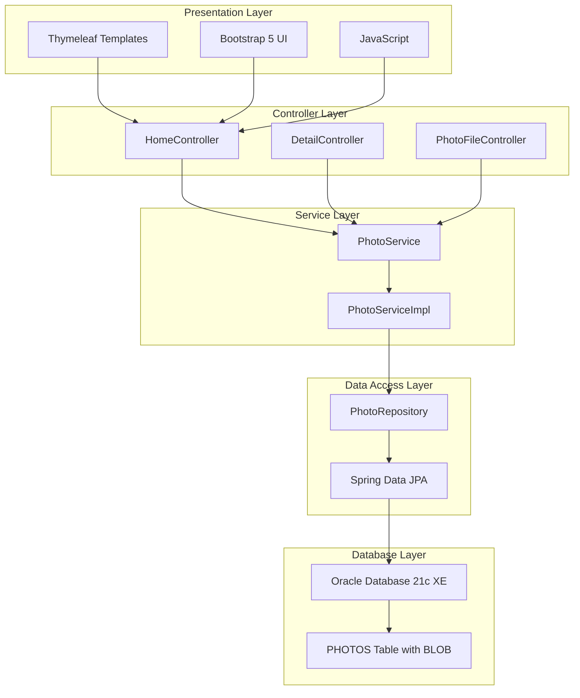
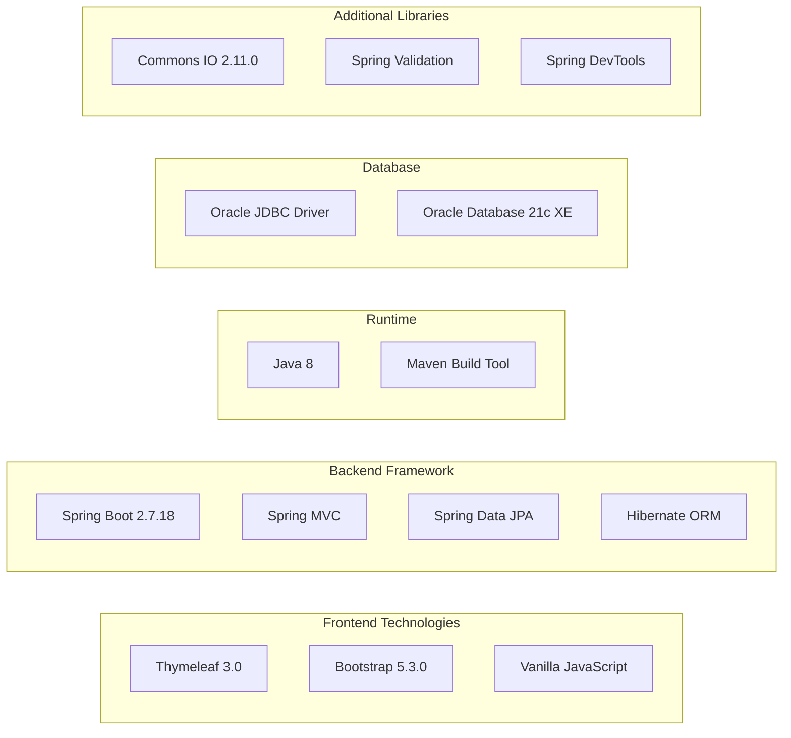
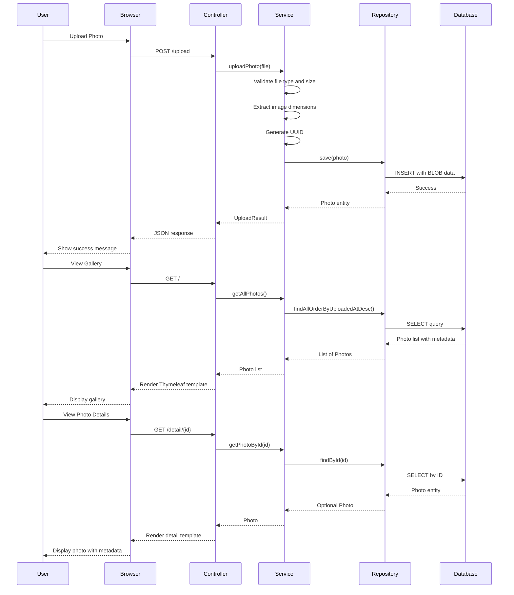
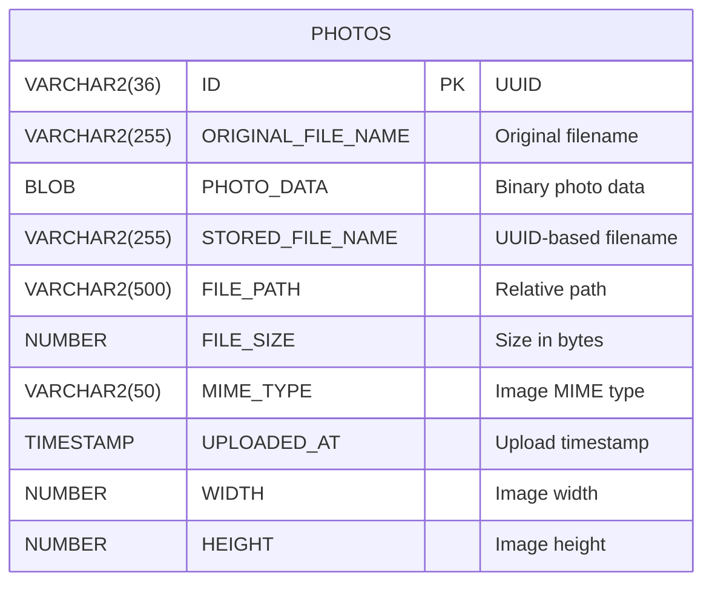

# Photo Album Application - Architecture Diagram

This diagram represents the current architecture of the Photo Album Java application based on the assessment analysis.

## Application Architecture

## Application Layers

## Technology Stack

## Data Flow

## Key Components

### Controllers
- **HomeController**: Gallery view and photo upload
- **DetailController**: Full-size photo view with navigation
- **PhotoFileController**: Photo binary data retrieval

### Services
- **PhotoService**: Business logic interface
- **PhotoServiceImpl**: Photo operations implementation with validation

### Repository
- **PhotoRepository**: Spring Data JPA repository with custom Oracle queries

### Model
- **Photo**: JPA entity with BLOB storage for photo data
- **UploadResult**: Upload operation result wrapper

## Database Schema

## Configuration

### Application Properties
- Server Port: 8080
- Database: Oracle Database with JDBC connection
- JPA: Hibernate with Oracle dialect, auto-DDL enabled
- File Upload: Max 10MB per file, 50MB per request
- Supported formats: JPEG, PNG, GIF, WebP
- Logging: DEBUG level for application and web components

### Deployment
- Containerization: Docker with docker-compose
- Database Container: Oracle Database 21c Express Edition
- Application Container: Spring Boot JAR with Maven build

## Storage Architecture

### Current Implementation
- **Photo Storage**: BLOB data in Oracle database
- **Benefits**: 
  - No file system dependencies
  - ACID compliance
  - Simplified containerized deployment
  - Easy backup and migration
- **Trade-offs**: 
  - Database size increases with photos
  - Network overhead for binary data

## Assessment Notes

### Framework & Dependencies
- Spring Boot 2.7.18 (maintenance support until 2025)
- Java 8 (legacy version, consider upgrading to Java 11/17/21)
- Oracle Database 21c XE (limited to 2 CPU, 2GB RAM, 12GB storage)
- Using Oracle-specific SQL features (TO_CHAR, ROWNUM, analytical functions)

### Modernization Opportunities
- Upgrade to newer Java LTS version (11, 17, or 21)
- Migrate to Spring Boot 3.x for extended support
- Consider Azure-managed databases (Azure SQL, PostgreSQL, or Cosmos DB)
- Implement Azure Blob Storage for photo files
- Add caching layer (Redis/Azure Cache for Redis)
- Implement CDN for photo delivery
- Add authentication and authorization
- Implement health checks and monitoring

### Cloud Migration Considerations
- **Target Platform**: Azure App Service, Azure Container Apps, or AKS
- **Database Migration**: Azure SQL Database, PostgreSQL, or keep Oracle on Azure VMs
- **Storage Migration**: Azure Blob Storage for photos
- **Observability**: Application Insights integration
- **Security**: Azure Key Vault for secrets, Managed Identity for authentication
