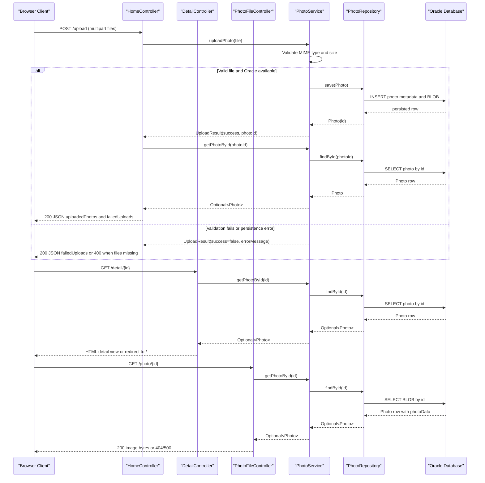

# API & Service Communication Contracts

The application exposes five HTTP endpoints across three Spring MVC controllers: three server-rendered page/file retrieval routes and two mutation routes for upload and delete operations. Communication is entirely synchronous over HTTP within a single Spring Boot service backed by Oracle Database, and no API versioning, messaging, gateway aggregation, or downstream service-to-service calls were found.

## Service Catalog

| Service | Port | Category | Purpose |
| --- | --- | --- | --- |
| photoalbum-java-app | 8080 | API Layer | Spring Boot web application that serves the gallery UI, accepts multipart uploads, streams stored images, and handles photo deletion/navigation. |
| oracle-db | 1521 | Infrastructure | Oracle Database container that stores photo metadata and BLOB image content for the application. |

## API Endpoints Inventory

| Service | Method | Path | Request Type | Response Type |
| --- | --- | --- | --- | --- |
| photoalbum-java-app | GET | `/` | No request body; optional browser query params are ignored | Thymeleaf `index` view with model attribute `photos: List<Photo>` and `timestamp`; `200 OK` |
| photoalbum-java-app | POST | `/upload` | `multipart/form-data` with `files: List<MultipartFile>` | JSON `Map<String,Object>` containing `success`, `uploadedPhotos`, and `failedUploads`; `200 OK` on processed uploads, `400 Bad Request` when no files are submitted |
| photoalbum-java-app | GET | `/detail/{id}` | Path parameter `id: String` | Thymeleaf `detail` view with `photo: Photo`, `previousPhotoId`, `nextPhotoId`; redirects to `/` when the photo is missing or the id is blank |
| photoalbum-java-app | POST | `/detail/{id}/delete` | Path parameter `id: String`; no request body | Redirect to `/` with flash attributes describing success or failure |
| photoalbum-java-app | GET | `/photo/{id}` | Path parameter `id: String` | Binary `Resource` response with dynamic image media type and cache-busting headers; `200 OK`, `404 Not Found`, or `500 Internal Server Error` |

## Management & Observability Endpoints

| Service | Endpoint | Custom Metrics (if any) |
| --- | --- | --- |
| photoalbum-java-app | None detected; no Spring Boot Actuator, `/health`, `/metrics`, or Swagger/OpenAPI endpoints are configured | None |

## DTOs & Contracts

No gateway-level DTOs were found because the project is a single deployable Spring Boot application with no API gateway or cross-service aggregation layer. At the service boundary, `Photo` is the main contract class used to populate Thymeleaf models for gallery and detail pages, while `UploadResult` is a mutable service-level result object used internally by `PhotoService` to track per-file upload success, generated photo ids, and errors.

The `/upload` endpoint does not expose a dedicated request or response DTO; instead it accepts Spring MVC `MultipartFile` inputs and returns an ad hoc Jackson-serialized `Map<String,Object>` assembled in `HomeController`, with `uploadedPhotos` entries derived from selected `Photo` metadata and `failedUploads` entries derived from `UploadResult`. Both `Photo` and `UploadResult` are mutable Java classes with getters/setters rather than immutable records or value objects. Binary image bytes remain outside the JSON contract and are served separately through `/photo/{id}` as a `ByteArrayResource`. No OpenAPI, Swagger, GraphQL, or protobuf contract definitions were found, and serialization relies on the default Spring Boot Jackson stack from `spring-boot-starter-web`/`spring-boot-starter-json`.

## Communication Patterns

Client-to-server communication is synchronous HTTP only. Browser requests terminate in Spring MVC controllers (`HomeController`, `DetailController`, `PhotoFileController`), which call `PhotoService` through direct in-process method invocation; `PhotoServiceImpl` then uses `PhotoRepository` and synchronous JPA/native SQL access to Oracle Database. No outbound REST clients, gRPC clients, service mesh, or cross-module RPC boundaries were found.

No asynchronous messaging patterns are configured: there are no Kafka, RabbitMQ, JMS, scheduled event, or pub/sub dependencies or listeners in the codebase. Likewise, no resilience libraries or annotations were found for circuit breaking, retries, bulkheads, or explicit timeout policies. Service discovery and client-side load balancing are absent, and there is no API gateway layer. The only startup dependency chain that affects availability is in `docker-compose.yml`, where `photoalbum-java-app` waits for the `oracle-db` container health check before starting.

Security posture is minimal at the API contract level: no Spring Security dependency or security configuration is present, no authentication or authorization annotations are used on controllers, and no HTTPS/TLS termination is configured in the application or compose file. As deployed from the provided configuration, all endpoints are publicly reachable over plain HTTP on port 8080 with no API-level authorization checks.

## Service Technology Matrix

| Service | Web | Data Access | Discovery | Gateway | Actuator | Cache | Metrics |
| --- | --- | --- | --- | --- | --- | --- | --- |
| photoalbum-java-app | Spring MVC + Thymeleaf | Spring Data JPA with Oracle native queries | None | None | None | None | None |
| oracle-db | None | Oracle Database | None | None | None | None | None |

## Service Communication Sequence

