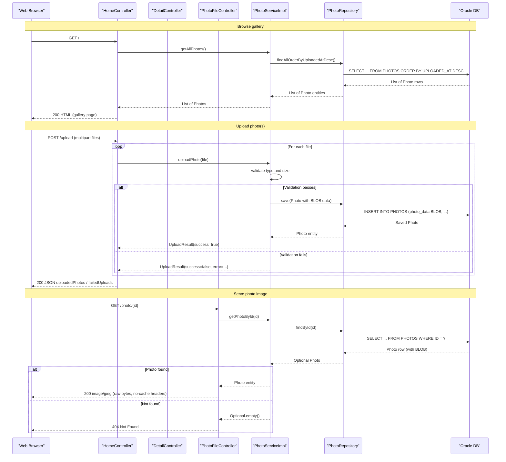

# API & Service Communication Contracts

The Photo Album application exposes 5 HTTP endpoints across 3 Spring MVC controllers, using synchronous REST communication with no inter-service messaging or API gateway.

## Service Catalog

| Service | Port | Category | Purpose |
|---|---|---|---|
| photoalbum-java-app | 8080 | Business | Spring Boot web application — serves photo gallery UI, handles upload/delete, and serves raw photo bytes |
| oracle-db | 1521 | Infrastructure | Oracle Database Free 23ai — primary data store for photo metadata and BLOB data |

## API Endpoints Inventory

| Controller | Method | Path | Request Type | Response Type |
|---|---|---|---|---|
| HomeController | GET | / | — | HTML (Thymeleaf `index` view) with photo list |
| HomeController | POST | /upload | Multipart form-data (`files`: List of MultipartFile) | JSON `Map<String,Object>` with `uploadedPhotos` / `failedUploads` lists; HTTP 200 or 400 |
| DetailController | GET | /detail/{id} | Path param: `id` (UUID string) | HTML (Thymeleaf `detail` view) or redirect to / if not found |
| DetailController | POST | /detail/{id}/delete | Path param: `id` (UUID string) | Redirect to / with flash message |
| PhotoFileController | GET | /photo/{id} | Path param: `id` (UUID string) | Raw image bytes (`Content-Type` from stored MIME type); HTTP 200, 404, or 500 |

## Management & Observability Endpoints

| Service | Endpoint | Notes |
|---|---|---|
| photoalbum-java-app | _(none)_ | Spring Boot Actuator is not on the classpath; no `/actuator/health` or metrics endpoints are exposed |

No custom metrics annotations (`@Timed`, Micrometer) are used in the codebase.

## DTOs & Contracts

**Service-level DTOs** (owned by the single service):

- **`Photo`** — JPA entity used as both a persistence model and the response type passed to Thymeleaf views and the upload JSON response. Carries photo metadata and the raw BLOB byte array. Not immutable (mutable POJO with setters). Full field and persistence details are documented in `data-architecture.md`.
- **`UploadResult`** — A plain POJO acting as the internal transfer object between `PhotoServiceImpl` and `HomeController`. Carries upload success status, file name, photo ID, and error message. Not exposed directly as a JSON response; the controller maps its fields into an ad-hoc `Map<String, Object>` before serialization.

No OpenAPI/Swagger specifications, `.proto` files, or GraphQL schemas are present. Jackson (via `spring-boot-starter-json`) is used for JSON serialization of the upload response; no custom serializers are configured.

## Communication Patterns

**Synchronous**: All communication is synchronous request/response over HTTP. The browser talks directly to the Spring Boot application; there is no API gateway, BFF, or reverse proxy layer in the application stack. The application calls Oracle via JDBC (Hibernate/Spring Data JPA) synchronously within each request thread.

**Asynchronous**: No messaging, event-driven, or pub/sub patterns are used.

**Resilience**: No circuit breaker (Resilience4j, Spring Retry), retry policy, or timeout configuration is implemented at the application level. Database connection pool timeouts (HikariCP defaults from Spring Boot) are the only implicit resource limits.

**Service discovery**: Services are addressed by Docker Compose DNS hostname (`oracle-db`) hardcoded in `application-docker.properties`. No dynamic service discovery (Eureka, Consul, Kubernetes DNS) is used.

**Startup dependency chain**: The application container (`photoalbum-java-app`) has a `depends_on: oracle-db: condition: service_healthy` constraint in Docker Compose, ensuring Oracle is healthy before the application starts. Details are covered in `configuration-inventory.md`.

**Security posture**: No authentication, authorization, or TLS is configured. All 5 endpoints — including photo upload and deletion — are publicly accessible with no credential checks. Spring Security is not on the classpath.

## Service Technology Matrix

| Service | Web Framework | Data Access | Discovery | Gateway | Actuator | Cache | Metrics |
|---|---|---|---|---|---|---|---|
| photoalbum-java-app | Spring MVC (servlet) | Spring Data JPA / Hibernate 5 | None (hardcoded host) | None | None | None | None |
| oracle-db | N/A (third-party) | N/A | N/A | N/A | N/A | N/A | N/A |

## Service Communication Sequence

