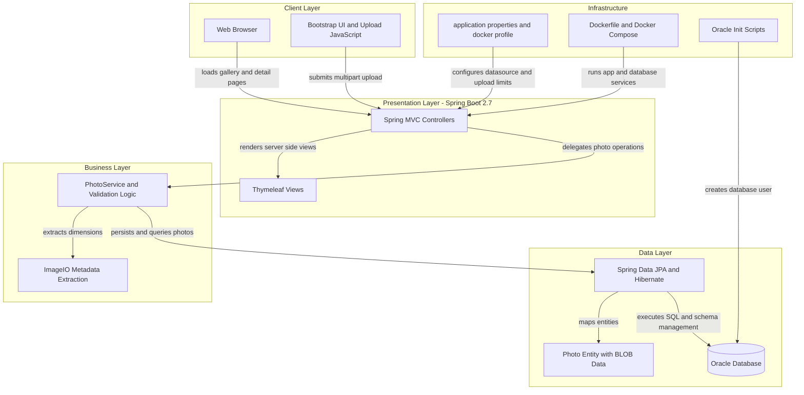
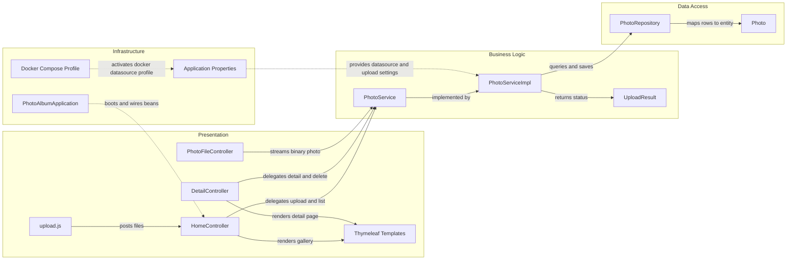

# Architecture Diagram

This diagram summarizes the Photo Album application as a layered Spring Boot web application that serves a Thymeleaf UI, processes image uploads, and stores photo binaries and metadata in Oracle Database. It also highlights the main runtime components and how requests move from the browser through the service and persistence layers.

## Application Architecture

### Technology Stack Summary

| Layer | Technology | Version | Purpose |
| --- | --- | --- | --- |
| Client | Bootstrap, Thymeleaf rendered HTML, Vanilla JavaScript | Bootstrap 5.3.0, Thymeleaf via Spring Boot 2.7.18 | Responsive gallery UI and drag and drop upload experience |
| Presentation | Spring Boot Web and Spring MVC | 2.7.18 | Handles HTTP requests for gallery, detail, upload, and photo streaming |
| Business Logic | Spring Service layer, Bean Validation, ImageIO | Spring Boot 2.7.18, Java 8 | Validates uploads, extracts image dimensions, and coordinates photo lifecycle operations |
| Data Access | Spring Data JPA and Hibernate | Spring Boot 2.7.18 | Maps entities and executes repository queries against Oracle |
| Data Storage | Oracle Database with JDBC driver | ojdbc8 runtime, Oracle configured via compose | Stores photo metadata and binary image content as BLOBs |
| Infrastructure | Maven, Dockerfile, Docker Compose | Maven via Spring Boot parent 2.7.18, Docker Compose | Builds the jar, packages the container, and runs the app with Oracle |
| Testing | Spring Boot Test with H2 | Spring Boot 2.7.18, H2 test scope | Loads the application context with an in memory database for tests |

### Data Storage & External Services

The application relies on Oracle Database as its primary and only runtime data store, persisting both photo metadata and the image bytes in a single `PHOTOS` table through JPA and native Oracle queries. There is no cache, message broker, or third party API integration in the runtime path; the only adjacent infrastructure is Docker Compose, which provisions the Spring Boot container and the Oracle container together, while H2 is used only for tests.

### Key Architectural Decisions

- Uses a classic layered monolith: Spring MVC controllers call a single service abstraction, which delegates persistence to a Spring Data repository.
- Stores uploaded images directly in Oracle BLOB columns instead of the file system, simplifying containerized deployment and backup at the cost of database growth.
- Uses Oracle specific native SQL in the repository for ordering, navigation, pagination, and analytical queries, coupling the persistence layer tightly to Oracle behavior.

## Component Relationships

### Component Inventory

| Component | Layer | Type | Responsibility |
| --- | --- | --- | --- |
| PhotoAlbumApplication | Infrastructure | Spring Boot application | Starts the application and enables component scanning and auto configuration |
| Application Properties | Infrastructure | Configuration | Defines server port, datasource settings, JPA behavior, logging, and upload limits |
| Docker Compose Profile | Infrastructure | Deployment configuration | Runs the application with Oracle and injects docker specific datasource settings |
| HomeController | Presentation | MVC Controller | Serves the gallery page and handles multipart upload requests |
| DetailController | Presentation | MVC Controller | Displays a single photo view, navigation links, and delete actions |
| PhotoFileController | Presentation | MVC Controller | Streams image bytes from database storage back to the browser |
| Thymeleaf Templates | Presentation | Server side views | Render the gallery and detail pages returned by controllers |
| upload.js | Presentation | Frontend script | Validates files in the browser and posts uploads asynchronously |
| PhotoService | Business Logic | Service interface | Defines the application use cases for listing, uploading, deleting, and navigating photos |
| PhotoServiceImpl | Business Logic | Service implementation | Applies validation, extracts image metadata, and coordinates repository access |
| UploadResult | Business Logic | DTO | Carries upload success, error, and photo identifier data back to the controller |
| PhotoRepository | Data Access | JPA Repository | Executes CRUD and Oracle specific native queries for photo retrieval patterns |
| Photo | Data Access | JPA Entity | Represents persisted photo metadata and binary image content |