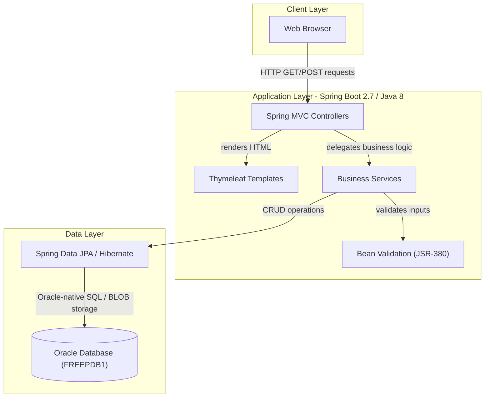
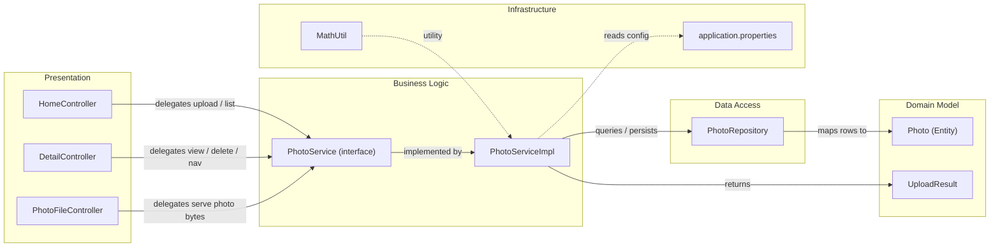

# Architecture Diagram

This document describes the architecture of the Photo Album application — a Spring Boot 2.7 web application that allows users to upload, browse, and manage photos stored as BLOBs in an Oracle database.

## Application Architecture

### Technology Stack Summary

| Layer | Technology | Version | Purpose |
|---|---|---|---|
| Presentation | Spring MVC | 2.7.18 (Boot) | HTTP request handling and routing |
| Presentation | Thymeleaf | 3.x (via Boot) | Server-side HTML templating |
| Business Logic | Spring Boot | 2.7.18 | Application framework and auto-configuration |
| Business Logic | Bean Validation | JSR-380 | Input validation for file uploads |
| Data Access | Spring Data JPA | 2.7.18 (Boot) | Repository abstraction and ORM |
| Data Access | Hibernate | 5.x (via Boot) | JPA provider |
| Database | Oracle Database | FREEPDB1 | Primary data store (photos as BLOBs) |
| Build | Apache Maven | 3.x | Dependency management and build |
| Runtime | Java | 8 (1.8) | Application runtime |

### Data Storage & External Services

The application relies on a single Oracle Database instance (`oracle-db:1521/FREEPDB1`) as its sole data store. All photo binary data is persisted directly as BLOB columns in the `PHOTOS` table alongside metadata such as original file name, MIME type, dimensions, file size, and upload timestamp. There are no external message brokers, caches, or third-party API integrations; the architecture is intentionally minimal and self-contained.

### Key Architectural Decisions

- **Database BLOB storage**: Photo binary data is stored directly as Oracle BLOB columns rather than the filesystem, simplifying deployment and eliminating filesystem state management.
- **Spring Data JPA with Oracle-native queries**: The repository uses both standard JPA methods and Oracle-specific native SQL (e.g., `ROWNUM`, `TO_CHAR`, `RANK() OVER`) for pagination and analytics.
- **Constructor injection**: All Spring components use constructor-based dependency injection, ensuring immutability and testability.

## Component Relationships

### Component Inventory

| Component | Layer | Type | Responsibility |
|---|---|---|---|
| HomeController | Presentation | Spring MVC Controller | Handles gallery page (GET /) and multi-file upload (POST /upload) |
| DetailController | Presentation | Spring MVC Controller | Displays single photo detail (/detail/{id}) and handles delete (POST /detail/{id}/delete) |
| PhotoFileController | Presentation | Spring MVC Controller | Serves raw photo bytes from DB BLOB (/photo/{id}) |
| PhotoService | Business Logic | Service Interface | Defines contract for photo CRUD and navigation operations |
| PhotoServiceImpl | Business Logic | Service Implementation | Validates uploads, manages BLOB data, delegates to repository |
| PhotoRepository | Data Access | Spring Data JPA Repository | Oracle-native queries for photo retrieval, pagination, and analytics |
| Photo | Domain Model | JPA Entity | Maps the `PHOTOS` table including BLOB column and metadata |
| UploadResult | Domain Model | DTO | Carries upload outcome (success/failure, photo ID, error message) |
| MathUtil | Infrastructure | Utility Class | Provides GCD calculation (aspect ratio computation) |
