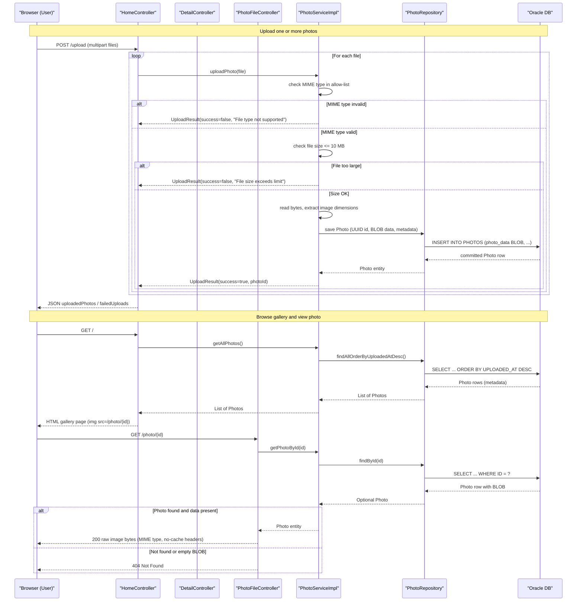

# Core Business Workflows

The Photo Album application lets users upload, browse, view, and delete personal photos, storing image binaries alongside descriptive metadata in a single shared database.

## Domain Entities

| Entity | Service / Bounded Context | Description | Key Relationships |
|---|---|---|---|
| `Photo` | Photo Management (sole bounded context) | Represents a single uploaded image with metadata: filename, MIME type, dimensions, file size, and upload timestamp | No relationships to other entities; self-contained aggregate |

## Service-to-Domain Mapping

| Service | Domain Context | Owned Entities | External Dependencies |
|---|---|---|---|
| photoalbum-java-app | Photo Management | `Photo` | Oracle Database (sole persistence target); no downstream services |

The application is a single-bounded-context monolith. All domain logic lives in `PhotoServiceImpl`. There are no cross-service interactions; data never leaves this service except as HTTP responses to the browser.

## Primary Workflows

### Workflow 1: Browse Gallery

A user opens the homepage to view all uploaded photos in reverse-chronological order.

1. Browser sends `GET /` to `HomeController`.
2. `HomeController` calls `PhotoService.getAllPhotos()`.
3. `PhotoServiceImpl` delegates to `PhotoRepository.findAllOrderByUploadedAtDesc()`, which executes an Oracle native query sorted by `UPLOADED_AT DESC`.
4. The resulting list of `Photo` entities (metadata only — BLOB data is not loaded in this query) is passed to the Thymeleaf `index` template.
5. The template renders each photo as an `` tag whose `src` points to `/photo/{id}`.
6. For each `` the browser issues a separate `GET /photo/{id}` request (Workflow 3 below).

Business rules applied: none beyond basic error handling (an empty list is returned if the query fails).

---

### Workflow 2: Upload Photo(s)

A user selects one or more image files and submits them for storage.

1. Browser sends `POST /upload` with a multipart form containing one or more files.
2. `HomeController` iterates over each `MultipartFile` and calls `PhotoService.uploadPhoto(file)` for each.
3. For each file, `PhotoServiceImpl` runs the following validation checks in order:
   - **MIME type check**: rejects the file with an error message if the content type is not in the configured allow-list.
   - **File size check**: rejects the file if its byte count exceeds `app.file-upload.max-file-size-bytes` (10 MB).
   - **Empty file check**: rejects the file if its size is 0 bytes.
4. If validation passes:
   - Raw bytes are read via `MultipartFile.getBytes()`.
   - Image dimensions (width × height) are extracted using `javax.imageio.ImageIO`.
   - A `Photo` entity is created with a client-generated UUID and the BLOB data.
   - The entity is persisted to Oracle via `PhotoRepository.save()`.
   - An `UploadResult(success=true, photoId=...)` is returned.
5. If validation fails, `UploadResult(success=false, errorMessage=...)` is returned without touching the database.
6. After all files are processed, `HomeController` assembles a JSON response with two lists: `uploadedPhotos` (IDs, filenames, metadata) and `failedUploads` (filenames and error messages).
7. An overall `success: true` flag is set only if at least one file uploaded successfully.

---

### Workflow 3: Serve Photo Image

The browser fetches the raw binary for a specific photo to render it.

1. Browser sends `GET /photo/{id}` to `PhotoFileController`.
2. `PhotoFileController` calls `PhotoService.getPhotoById(id)` to retrieve the `Photo` entity including its BLOB data.
3. If not found, returns HTTP 404.
4. If found but `photoData` is null or empty, returns HTTP 404 with an error log.
5. If found and data present, returns the raw byte array as the HTTP response body with:
   - `Content-Type` set to the stored MIME type.
   - Aggressive no-cache headers (`Cache-Control: no-cache, no-store, must-revalidate`).

---

### Workflow 4: View Single Photo Detail

A user clicks on a thumbnail to view a photo full-size with navigation to adjacent photos.

1. Browser sends `GET /detail/{id}` to `DetailController`.
2. `DetailController` calls `PhotoService.getPhotoById(id)`.
3. If not found, redirects to `/`.
4. If found, calls `PhotoService.getPreviousPhoto(photo)` and `PhotoService.getNextPhoto(photo)` to locate the chronologically adjacent photos using Oracle timestamp comparison queries.
5. Passes `photo`, `previousPhotoId`, and `nextPhotoId` to the Thymeleaf `detail` template for rendering.

---

### Workflow 5: Delete Photo

A user deletes a photo from the detail view.

1. Browser sends `POST /detail/{id}/delete` to `DetailController`.
2. `DetailController` calls `PhotoService.deletePhoto(id)`.
3. `PhotoServiceImpl` retrieves the `Photo` entity; if not found, returns `false` and a "not found" flash message.
4. If found, calls `PhotoRepository.delete(photo)`, which removes the row (including BLOB data) from Oracle.
5. On success, a "Photo deleted successfully" flash message is set and the user is redirected to `/`.
6. On exception, an error flash message is set and the user is redirected to `/`.

## Cross-Service Data Flows

The application has a single service and a single database; there are no cross-service data flows. All reads and writes go directly from the single Spring Boot application to Oracle via JPA/Hibernate. No API gateway aggregation, event-driven composition, or inter-service calls exist. For circuit-breaker fallback behavior, see `api-service-contracts.md` — none is configured.

## Business Workflow Sequence

## Business Rules & Decision Logic

### Validation Rules (Upload)

| Rule | Condition | Outcome |
|---|---|---|
| Allowed MIME type | Content type must be one of: `image/jpeg`, `image/png`, `image/gif`, `image/webp` | Reject with "File type not supported" |
| Maximum file size | File byte count must be ≤ 10,485,760 bytes (10 MB) | Reject with "File size exceeds NMB limit" |
| Non-empty file | File size must be > 0 bytes | Reject with "File is empty" |

### Decision Logic

- **Partial upload success**: If a batch upload contains a mix of valid and invalid files, valid ones are stored and invalid ones are reported separately. The overall `success` flag is `true` as long as at least one file succeeded. The client must inspect `failedUploads` to learn about individual failures.
- **Photo navigation**: Previous/next photo is determined by upload timestamp comparison (`UPLOADED_AT < current` / `UPLOADED_AT > current`), not by row sequence or ID. Only the first result of each query is used for navigation.
- **Dimension extraction is non-blocking**: If `javax.imageio.ImageIO` cannot parse the image dimensions (e.g., unsupported format), the upload still proceeds with `width = null` / `height = null`.

### State Transitions

The `Photo` entity has no explicit lifecycle state machine. Once persisted it remains visible in the gallery until explicitly deleted. There is no soft-delete, archive, or visibility flag.

### Transactions

`PhotoServiceImpl` is annotated `@Transactional` at the class level. Each upload and delete operation runs in its own transaction. Read operations use `@Transactional(readOnly = true)`. There are no multi-step sagas or distributed transactions.

### Error Handling

All service methods catch `Exception` broadly. Upload failures return an `UploadResult` with `success=false` and an error message. Gallery load failures return an empty photo list rather than propagating to the user. Delete and photo-serve failures are logged and result in redirect or HTTP 5xx responses respectively.

### Authorization

No authentication or authorization is enforced. Any user with network access can upload, view, or delete any photo. See `api-service-contracts.md` for the security posture assessment.
