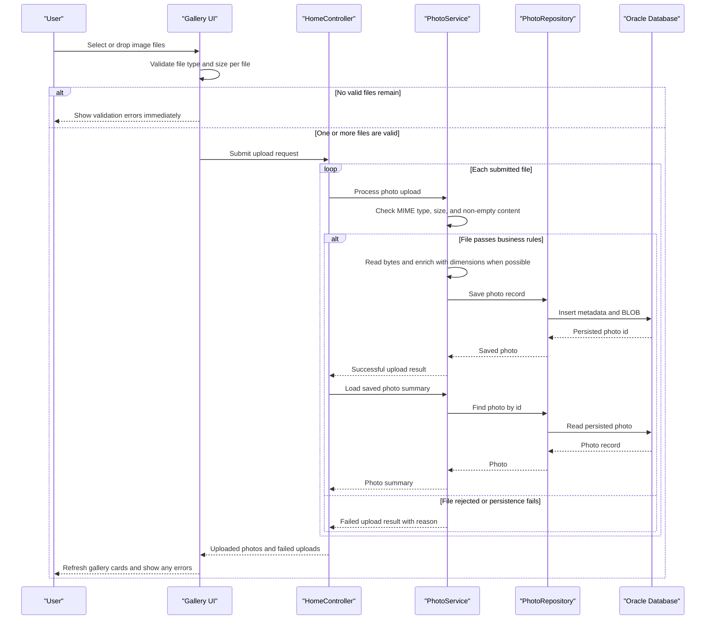

# Core Business Workflows

This application is a personal photo album and gallery system that lets users upload image files, browse them in reverse chronological order, view individual photos, and remove photos they no longer want to keep. Its core business behavior centers on turning uploaded image files into managed gallery items with metadata, navigation context, and binary delivery from the database.

## Domain Entities

| Entity | Service / Bounded Context | Description | Key Relationships |
| --- | --- | --- | --- |
| Photo | Photo Management | Core business record representing an uploaded image that becomes part of the user's gallery, including its display metadata and stored binary content. | Created during upload, listed in the gallery, streamed by the file delivery flow, and removed by the delete flow. Navigation to adjacent photos is derived from each photo's upload timestamp. |
| Gallery | Gallery Browsing | Ordered business collection of photos presented to the user as the album's main view. | Composed from `Photo` records ordered newest-first; links each item to detail and binary delivery workflows. |
| UploadResult | Upload Intake | Per-file business outcome that records whether a submitted image was accepted or rejected and why. | Produced by `PhotoService` during batch upload and merged by `HomeController` into success and failure response groups. |

## Service-to-Domain Mapping

| Service | Domain Context | Owned Entities | External Dependencies |
| --- | --- | --- | --- |
| `HomeController` | Upload Intake and Gallery Presentation | `Gallery`, `UploadResult`, selected `Photo` metadata for newly accepted uploads | `PhotoService` for reads/writes; browser multipart submissions |
| `DetailController` | Photo Detail, Navigation, and Lifecycle | `Photo`, derived previous/next navigation context | `PhotoService`; redirect/flash-message flow back to the gallery |
| `PhotoFileController` | Binary Photo Delivery | `Photo` binary asset delivery | `PhotoService`; Oracle-backed BLOB retrieval exposed as HTTP image content |
| `PhotoServiceImpl` | Core Photo Management | `Photo`, `UploadResult` | `PhotoRepository`; Oracle Database for persistence; image decoding via `ImageIO` for dimension enrichment |
| `PhotoRepository` | Persistence Access | Persisted `Photo` records | Oracle SQL queries for newest-first listing, older/newer navigation lookups, and CRUD operations |

## Primary Workflows

### Workflow 1: Upload Photos into the Gallery

A user selects or drags one or more image files into the gallery page. The browser performs client-side screening for supported image types and the 10 MB limit, then submits the remaining files to the upload endpoint.

`HomeController` processes the upload as a batch but evaluates each file independently by calling `PhotoService.uploadPhoto`. The service applies the core business rules: the MIME type must be one of JPEG, PNG, GIF, or WebP; the file must not be empty; and the file size must not exceed the configured limit. For accepted files, the service generates a unique stored filename, reads the binary payload, attempts to derive image dimensions, creates a `Photo`, and persists it through `PhotoRepository` inside the transactional service boundary.

After a successful save, `HomeController` performs a read-after-write lookup to return authoritative metadata for the newly stored photo. The final response groups outcomes into `uploadedPhotos` and `failedUploads`, so a mixed batch can partially succeed without discarding the entire submission. Cross-component flow stays inside the monolith, but persistence depends on Oracle availability.

### Workflow 2: Browse the Gallery and Navigate Between Photos

When the user opens the root page, `HomeController` loads all photos through `PhotoService.getAllPhotos`, and the gallery is rendered newest-first as the album's primary browsing experience. If gallery loading fails, the controller degrades gracefully by showing an empty gallery model instead of failing the page entirely.

Selecting a gallery item opens the detail workflow through `DetailController`. The controller validates that the photo identifier is present, loads the current `Photo`, and then asks `PhotoService` for the previous and next photos based on upload time. This creates a navigation experience where adjacent photos are determined by chronology rather than by client-maintained state.

The detail page composes three related reads: the current photo record, the nearest older photo, and the nearest newer photo. There are no downstream microservices, but the workflow crosses controller, service, repository, and database layers to build one business view.

### Workflow 3: Delete a Photo from the Album

From the detail page, the user confirms deletion and submits the delete action. `DetailController` delegates to `PhotoService.deletePhoto`, which first verifies that the target photo exists and then removes it from persistence.

The business decision is binary: existing photos can transition from available to deleted, while missing photos are treated as a handled business miss rather than an exception. The controller translates the outcome into flash messaging for the gallery page, giving the user either a success confirmation, a not-found message, or a generic retry prompt when an unexpected failure occurs.

## Cross-Service Data Flows

The project is a single Spring Boot monolith, so there is no inter-microservice choreography, gateway aggregation, or event-driven fan-out. Instead, the meaningful data flows are cross-layer compositions inside one service boundary.

The upload flow is the main composition pattern: browser validation filters obvious invalid files, `HomeController` submits each file to `PhotoService`, `PhotoServiceImpl` persists accepted photos through `PhotoRepository`, and the controller then re-reads successful uploads to assemble a response that combines authoritative photo metadata with per-file failure reasons. This is effectively a read-after-write aggregation pattern within one request.

The detail flow is another composition pattern: `DetailController` combines the current photo with older/newer navigation lookups so the user receives a richer business view than a simple single-record fetch. `PhotoFileController` separately streams the binary image for the same `Photo` record, allowing the UI to compose metadata, navigation, and image bytes across multiple synchronous requests.

No circuit breaker or fallback integration pattern was found. Business degradation is handled at the controller level instead: gallery load failures return an empty list, missing detail ids redirect to the gallery, missing binary content returns `404`, and write failures are surfaced as user-facing error messages.

## Business Workflow Sequence

## Business Rules & Decision Logic

- **Accepted upload types:** Only `image/jpeg`, `image/png`, `image/gif`, and `image/webp` are accepted. Unsupported MIME types are rejected with a user-facing message.
- **File size and emptiness checks:** Each file must be non-empty and no larger than the configured 10 MB limit. Client-side checks improve usability, but the service revalidates on the server before saving.
- **Per-file decisioning for batches:** Multi-file uploads are not all-or-nothing; each file independently becomes either an accepted `Photo` or a rejected `UploadResult`, and the response may contain both successes and failures.
- **Best-effort enrichment:** The service tries to extract image dimensions for display metadata. A photo can still be stored without dimensions when enrichment is unavailable, but failure to read the actual file bytes causes the upload to fail.
- **Identifier and existence rules:** Blank ids are treated as invalid input for detail/binary retrieval, and missing photos are handled as not-found outcomes rather than silently creating placeholders.
- **Chronological navigation rule:** Gallery ordering is newest-first, and previous/next navigation is derived from `uploadedAt`, making upload time the decision key for adjacency.
- **Lifecycle states:** A photo moves from submitted -> validated -> persisted -> browsable/streamable, or from submitted -> rejected. Persisted photos can transition to deleted through the delete workflow.
- **Transaction boundaries:** `PhotoServiceImpl` is the transactional boundary for business writes. Reads are marked `readOnly`, while upload and delete operations run as state-changing transactions around repository access.
- **Error handling and user feedback:** Load failures on the gallery fall back to an empty model, missing detail requests redirect to `/`, photo streaming returns `404` or `500` as appropriate, and delete outcomes are surfaced through flash messages.
- **Audit and authorization posture:** The application logs business successes and failures around upload, retrieval, and deletion. No business-level authorization or ownership checks were found, so all workflows operate without user-specific access control.
