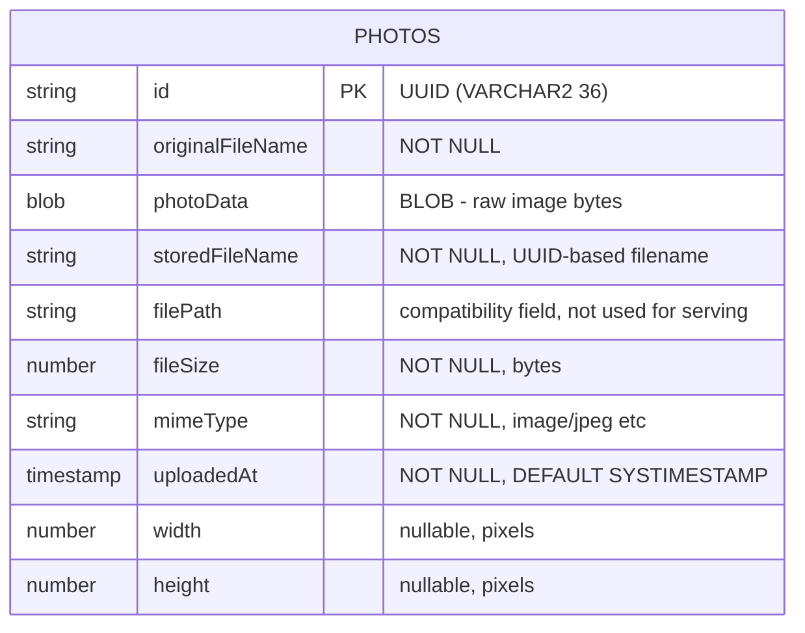

# Data Architecture & Persistence Layer

The application uses a single `Photo` JPA entity persisted to Oracle Database (production) or H2 (test), with photo binary data stored as an Oracle BLOB column and no caching layer.

## Database Configuration

| Service/Module | DB Type | Profile | Driver | Connection | Migration Tool |
|---|---|---|---|---|---|
| photoalbum-java-app | Oracle Database Free 23ai | default / docker | `oracle.jdbc.OracleDriver` (ojdbc8) | `jdbc:oracle:thin:@oracle-db:1521/FREEPDB1` (HikariCP defaults) | None — Hibernate DDL auto-generation (`create`) manages schema on every startup |
| photoalbum-java-app | H2 (in-memory) | test | `org.h2.Driver` | `jdbc:h2:mem:testdb` | Hibernate `create-drop` — schema created and dropped per test run |

Schema management behavior: Hibernate `create` mode drops and recreates all tables on every application startup — including production. No Flyway or Liquibase migration tooling is present. The Oracle user and tablespace are provisioned by a container-init SQL script (`oracle-init/01-create-user.sql`), but no schema versioning or seed data scripts exist. For full property inventory see `configuration-inventory.md`.

## Data Ownership per Service

| Service | Tables Owned | ORM Framework | Caching | Notes |
|---|---|---|---|---|
| photoalbum-java-app | `PHOTOS` | Spring Data JPA / Hibernate 5.x | None | Single-table design; BLOB column stores raw image bytes |

## Entity Model

The application contains a single entity, `Photo`, mapped to the `PHOTOS` table. No entity relationships (one-to-many, many-to-many) exist. An index `idx_photos_uploaded_at` is defined on `uploaded_at` for ordering queries. The `id` field is a client-generated UUID string (`UUID.randomUUID()`), not a database-generated sequence. All fields are managed by Hibernate; the `photoData` column is declared `@Lob` and mapped as `byte[]`.

Transaction management: `PhotoServiceImpl` is annotated `@Transactional` at the class level. Read-only operations (`getAllPhotos`, `getPhotoById`, `getPreviousPhoto`, `getNextPhoto`) use `@Transactional(readOnly = true)` to optimize connection-pool and Hibernate behavior.

## Key Repository Methods

| Repository | Notable Method | Parameters | Return Type | Purpose |
|---|---|---|---|---|
| `PhotoRepository` | `findAllOrderByUploadedAtDesc()` | — | `List<Photo>` | Returns all photos sorted newest-first (Oracle native query) |
| `PhotoRepository` | `findPhotosUploadedBefore(uploadedAt)` | `LocalDateTime uploadedAt` | `List<Photo>` | Returns up to 10 photos older than given timestamp (Oracle `ROWNUM`) for prev-navigation |
| `PhotoRepository` | `findPhotosUploadedAfter(uploadedAt)` | `LocalDateTime uploadedAt` | `List<Photo>` | Returns photos newer than given timestamp for next-navigation |
| `PhotoRepository` | `findPhotosByUploadMonth(year, month)` | `String year, String month` | `List<Photo>` | Filters photos by year/month using Oracle `TO_CHAR` — currently unused by controllers |
| `PhotoRepository` | `findPhotosWithPagination(startRow, endRow)` | `int startRow, int endRow` | `List<Photo>` | Oracle `ROWNUM`-based pagination — currently unused by controllers |
| `PhotoRepository` | `findPhotosWithStatistics()` | — | `List<Object[]>` | Oracle analytic `RANK() OVER` and `SUM() OVER` for file-size ranking and running totals — currently unused |

All standard CRUD methods (`findById`, `save`, `delete`, `findAll`) are inherited from `JpaRepository<Photo, String>`. The repository uses exclusively Oracle-native SQL queries; none of the queries are JPQL or HQL, making the repository non-portable to other databases.

## Caching Strategy

No caching layer is configured. There are no `@Cacheable`, `@CacheEvict`, Spring Cache, Hibernate second-level cache, or external cache providers (Redis, EhCache, Caffeine) in the application. Every request to display photos or serve image data triggers a live database query and BLOB read from Oracle.

Given that photos are large binary objects and read-frequently but write-rarely, the absence of caching (e.g., HTTP `Cache-Control` for served images, or a second-level cache for metadata) is a performance consideration for production workloads.

## Data Ownership Boundaries

The application follows a single-service, single-database architecture. There is only one logical data store and one owning service (`photoalbum-java-app`). There are no cross-service data access patterns, shared database concerns, or CQRS separation.

The schema is functionally a monolith: all data is in a single `PHOTOS` table, and all reads/writes flow through the same `PhotoRepository`. The only isolation boundary is the profile-based database switch (Oracle for production, H2 for tests).

### Data Classification & Sensitivity

| Entity | Sensitive Fields | Classification | Controls in Place |
|---|---|---|---|
| `Photo` | `originalFileName` (user-supplied filename) | Minimal — no direct PII | No masking; stored as-is |
| `Photo` | `photoData` (BLOB image content) | Potentially sensitive — user photos may contain PII (faces, documents) | No encryption-at-rest, no access control, no audit logging |

The application stores user-uploaded image files as BLOBs in Oracle without any encryption-at-rest, field-level masking, or access controls. If users upload photos containing personally identifiable information (faces, ID documents, location data embedded in EXIF metadata), that data is stored without protection. No authentication or authorization gates the upload or retrieval endpoints (see `api-service-contracts.md`).
