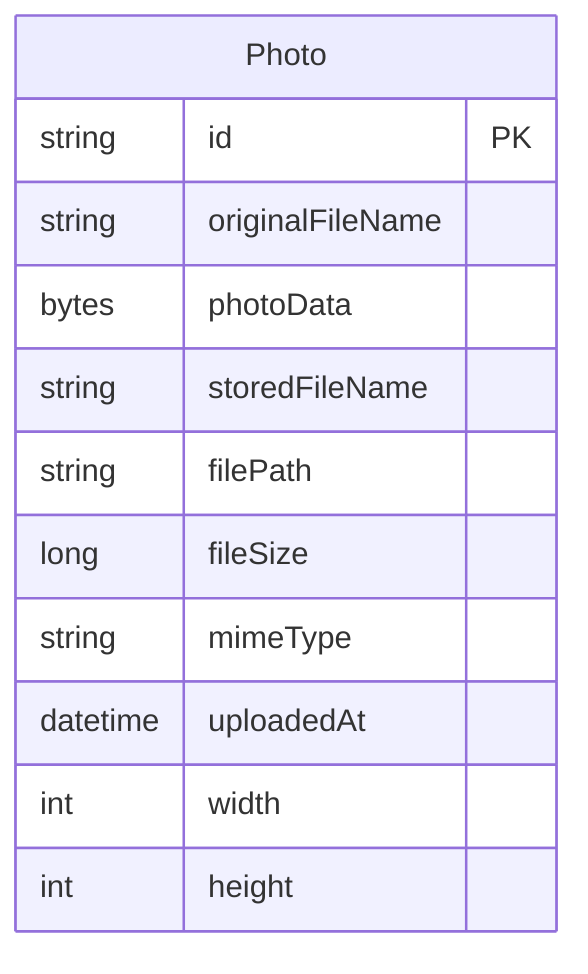

# Data Architecture & Persistence Layer

The data layer is a single Spring Data JPA persistence module centered on one `Photo` entity stored in a relational database. Runtime profiles use Oracle for application data and H2 for tests, with Hibernate managing schema lifecycle instead of a versioned migration tool.

## Database Configuration

| Service/Module | DB Type | Profile | Driver | Connection | Migration Tool |
| --- | --- | --- | --- | --- | --- |
| photo-album | Oracle | default | Oracle JDBC `ojdbc8` (`oracle.jdbc.OracleDriver`) | JDBC thin connection to `oracle-db:1521/FREEPDB1`; Spring Boot uses the default pooled `DataSource` implementation from the JPA starter with no explicit pool tuning checked in | None detected. Hibernate creates the schema at startup; no Flyway/Liquibase, `schema.sql`, `data.sql`, or `import.sql` files were found. |
| photo-album | Oracle | docker | Oracle JDBC `ojdbc8` (`oracle.jdbc.OracleDriver`) | JDBC thin connection to `oracle-db:1521:XE` from the application container; default Spring Boot pooled `DataSource` behavior | None detected. Hibernate recreates schema objects on startup; `oracle-init/*.sql` provisions the Oracle user and privileges, not versioned application tables. |
| photo-album | H2 in-memory | test | H2 (`org.h2.Driver`) | In-memory JDBC connection to `testdb` for Spring Boot tests | None detected. Hibernate creates and drops the test schema for each test context. |

## Data Ownership per Service

| Service | Tables Owned | ORM Framework | Caching | Notes |
| --- | --- | --- | --- | --- |
| Photo Album monolith | `PHOTOS` | Spring Data JPA with Hibernate | No explicit application cache configured | Single persistence boundary for the app. The same table stores image metadata and binary image content (BLOB), so no separate object store or metadata schema is used. |

## Entity Model

The entity model is defined by `src/main/java/com/photoalbum/model/Photo.java`. Transaction boundaries are managed in `PhotoServiceImpl`, where the service is class-level transactional and read operations are marked `readOnly`.

## Key Repository Methods

| Service | Repository | Notable Methods | Purpose |
| --- | --- | --- | --- |
| Photo Album monolith | `PhotoRepository` (`src/main/java/com/photoalbum/repository/PhotoRepository.java`) | `findAllOrderByUploadedAtDesc()` | Native Oracle query returning the gallery ordered newest-first. |
| Photo Album monolith | `PhotoRepository` (`src/main/java/com/photoalbum/repository/PhotoRepository.java`) | `findPhotosUploadedBefore(LocalDateTime uploadedAt)` | Fetches older photos for detail-page back navigation, capped with Oracle `ROWNUM`. |
| Photo Album monolith | `PhotoRepository` (`src/main/java/com/photoalbum/repository/PhotoRepository.java`) | `findPhotosUploadedAfter(LocalDateTime uploadedAt)` | Fetches newer photos for forward navigation ordered ascending by upload timestamp. |
| Photo Album monolith | `PhotoRepository` (`src/main/java/com/photoalbum/repository/PhotoRepository.java`) | `findPhotosByUploadMonth(String year, String month)` | Filters photos by year and month using Oracle `TO_CHAR`, enabling archive-style queries. |
| Photo Album monolith | `PhotoRepository` (`src/main/java/com/photoalbum/repository/PhotoRepository.java`) | `findPhotosWithPagination(int startRow, int endRow)` | Implements Oracle-specific paged reads with nested `ROWNUM` windows. |
| Photo Album monolith | `PhotoRepository` (`src/main/java/com/photoalbum/repository/PhotoRepository.java`) | `findPhotosWithStatistics()` | Uses Oracle analytic functions to return ranking and running-total statistics for photo sizes. |

## Caching Strategy

| Layer | Provider | TTL / Scope | Pattern | Rationale |
| --- | --- | --- | --- | --- |
| JPA persistence context | Hibernate first-level session cache | Transaction-scoped only | Read-through and deferred write/flush inside the active transaction | Comes implicitly from JPA/Hibernate because `PhotoServiceImpl` is transactional. |
| Application/query cache | None detected | None | No cache-aside/read-through cache beyond the persistence context | The repository reads directly from Oracle or H2 on each call, favoring consistency over reduced database load. |
| Second-level/distributed cache | None detected | None | Not configured | No Redis, Caffeine, Ehcache, JCache, or Spring Cache annotations/configuration were found. |

## Data Ownership Boundaries

The project has a single write-owning service and a single logical schema, so data ownership is straightforward: the Photo Album application exclusively owns the `PHOTOS` table and accesses it through `PhotoRepository`. There is no evidence of a database-per-service split, shared tables across multiple deployable services, outbox tables, or cross-service joins.

Within the monolith, controllers call `PhotoService`, and `PhotoServiceImpl` is the only component that coordinates persistence operations and transaction scope before delegating to Spring Data JPA. Read/write behavior is traditional CRUD rather than CQRS: uploads persist the `Photo` entity and its BLOB payload in one transaction, reads query the same table directly, and no external aggregation layer or API-mediated cross-store access is present.

### Data Classification & Sensitivity

| Entity | Sensitive Fields | Classification (PII/PHI/PCI/None) | Controls in Place |
| --- | --- | --- | --- |
| `Photo` | `originalFileName`; `photoData` may contain personal images and embedded EXIF metadata; `filePath`/`storedFileName` can reveal user-supplied naming patterns | PII | MIME type and size validation are enforced before persistence, but no field-level masking, encryption configuration, or explicit access-control rules for sensitive columns were found in the repository. |
| `Photo` | `mimeType`, `fileSize`, `uploadedAt`, `width`, `height`, `id` | None | Standard ORM mapping only; no additional protection required beyond normal database access control. |
