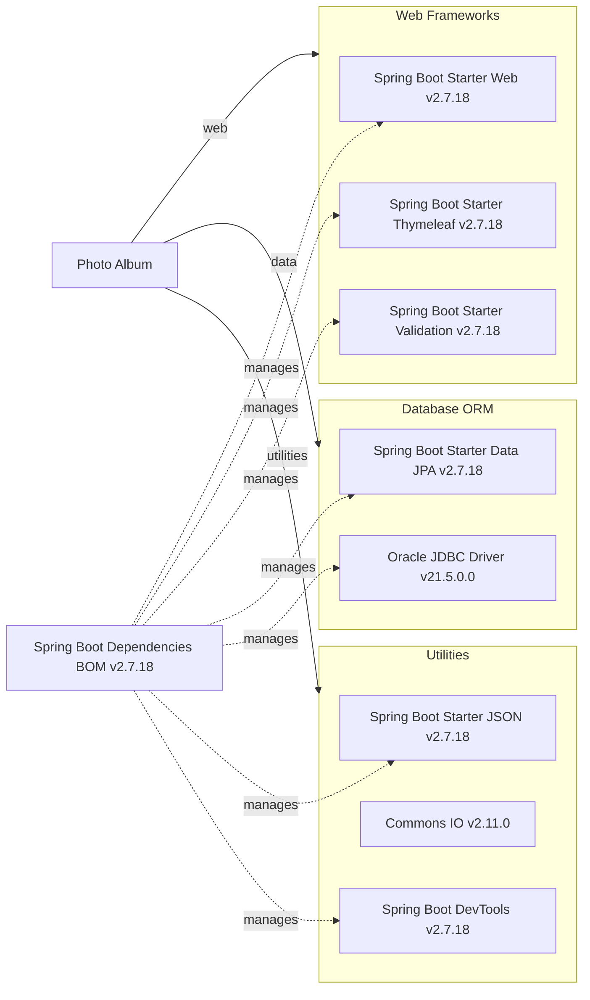

# Dependency Map

Photo Album declares 10 direct Maven dependencies in `pom.xml`, including 8 main runtime dependencies and 2 test scoped dependencies. Most versions are inherited from the `spring-boot-starter-parent` 2.7.18 parent, which in turn brings in the Spring Boot dependency BOM.

## Dependencies

### Dependency Summary

| Category | Count | Key Libraries | Notes |
|---|---:|---|---|
| Web Frameworks | 3 | Spring Boot Starter Web 2.7.18, Spring Boot Starter Thymeleaf 2.7.18, Spring Boot Starter Validation 2.7.18 | Conventional Spring MVC server rendered web stack |
| Database / ORM | 2 | Spring Boot Starter Data JPA 2.7.18, Oracle JDBC Driver 21.5.0.0 | JPA persistence with Oracle as the production database |
| Messaging | 0 | None declared | No explicit messaging client libraries in `pom.xml` |
| Caching | 0 | None declared | No cache provider or Redis client declared |
| Logging | 0 | None declared | Logging is supplied transitively by Spring Boot starters rather than direct declarations |
| Security | 0 | None declared | No explicit Spring Security or OAuth libraries are present |
| Observability | 0 | None declared | No Micrometer, OpenTelemetry, or Actuator dependency is declared |
| Utilities | 3 | Spring Boot Starter JSON 2.7.18, Commons IO 2.11.0, Spring Boot DevTools 2.7.18 | JSON support, file handling, and local developer tooling |

### Version & Compatibility Risks

The project is pinned to Java 8 and Spring Boot 2.7.18, which keeps it on the last Spring Boot 2.x generation and limits future upgrades that require Java 17 and Jakarta namespace changes. Oracle `ojdbc8` 21.5.0.0 and `commons-io` 2.11.0 are serviceable but older lines, so a modernization effort should plan for a coordinated upgrade of the Java runtime, Spring Boot baseline, and database driver.

### Notable Observations

- The project does not define a local `dependencyManagement` section; version alignment is delegated to `spring-boot-starter-parent` and the inherited `spring-boot-dependencies` BOM.
- There are no explicit security or observability dependencies, which suggests limited built in authentication, authorization, metrics, or tracing support.
- Logging is not declared directly in `pom.xml`; it arrives transitively through the Spring Boot starter stack.
- `spring-boot-devtools` is marked optional, so it should not be expected in production packaging but remains part of the developer experience.

## Test Dependencies

| Framework | Version | Notes |
|---|---:|---|
| Spring Boot Starter Test | 2.7.18 | Aggregated Spring test support declared directly in `pom.xml` |
| JUnit Jupiter | 5.8.2 | Primary unit testing framework pulled in by `spring-boot-starter-test` |
| Mockito | 4.5.1 | Mocking support via `mockito-core` and `mockito-junit-jupiter` |
| AssertJ | 3.22.0 | Fluent assertions library |
| Hamcrest | 2.2 | Matcher library included in the test starter |
| XMLUnit Core | 2.9.1 | XML comparison utilities for tests |
| H2 Database | 2.1.214 | In memory database declared directly for tests |

Total test-scope dependencies: 2
The test setup is centered on `spring-boot-starter-test`, which provides a standard Spring Boot test stack without extra integration tooling such as Testcontainers. H2 gives lightweight database coverage for tests, but it may not fully reflect Oracle specific behavior.