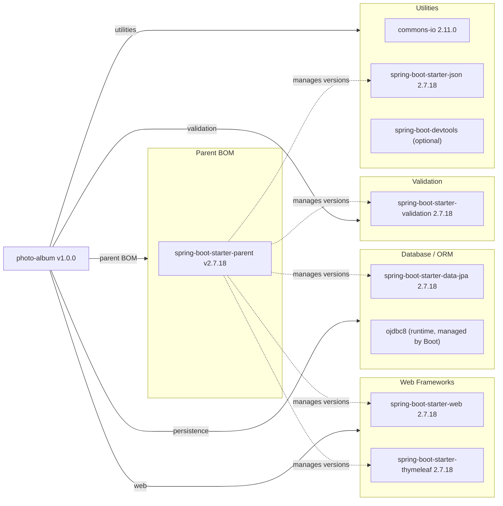

# Dependency Map

The Photo Album application is a Java 8 / Spring Boot 2.7.18 project with 8 declared runtime/compile dependencies managed through the Spring Boot BOM, plus 2 test-scoped dependencies.

## Dependencies

### Dependency Summary

| Category | Count | Key Libraries | Notes |
|---|---|---|---|
| Web Frameworks | 2 | Spring MVC 5.3.x (via Boot 2.7.18), Thymeleaf 3.0.x | Server-side MVC stack; Spring Boot 2.7.x is end-of-life (Nov 2023) |
| Database / ORM | 2 | Spring Data JPA / Hibernate 5.6.x, Oracle JDBC Driver 8 | Oracle BLOB storage; Hibernate 5 reaches EOL with Spring Boot 2.x |
| Validation | 1 | Hibernate Validator 6.x (JSR-380) | Bundled via spring-boot-starter-validation |
| Utilities | 3 | commons-io 2.11.0, Jackson 2.13.x, spring-boot-devtools | DevTools is optional/dev-only; Jackson provided via starter-json |

### Version & Compatibility Risks

**Spring Boot 2.7.18** reached end-of-life in November 2023; the current production release line is Spring Boot 3.x (requiring Java 17+). All Spring Framework, Hibernate, and Thymeleaf versions are pinned by the Boot BOM at levels that are now out of maintenance. **Hibernate 5.x** (bundled with Spring Boot 2.7.x) is superseded by Hibernate 6 shipped with Spring Boot 3.x. **commons-io 2.11.0** (released 2021) is not the latest (2.16.x as of 2024) but has no critical CVEs at this version. The **Java 8** target (`maven.compiler.source=8`) is the most significant constraint: upgrading to Spring Boot 3 will require a move to at least Java 17.

### Notable Observations

- **Java 8 / Spring Boot 2.7 combination is double-deprecated**: both the runtime and the framework are past their support windows, meaning no further security patches will be produced for this stack without an upgrade.
- **No security dependency declared**: The application has no Spring Security or equivalent access-control library. All endpoints (photo upload, delete) are unauthenticated.
- **No caching or observability libraries**: There are no caching (e.g., Redis/EhCache) or observability (e.g., Micrometer, Spring Actuator) dependencies declared, limiting operational insight.
- **Oracle-specific ROWNUM / TO_CHAR queries**: The use of Oracle native SQL in `PhotoRepository` creates a hard dependency on Oracle Database; migrating to another RDBMS (e.g., Azure SQL, PostgreSQL) would require rewriting these queries.

## Test Dependencies

| Framework | Version | Notes |
|---|---|---|
| spring-boot-starter-test | 2.7.18 (managed) | Bundles JUnit 5 (Jupiter), Mockito 4.x, AssertJ, Spring Test |
| H2 Database | 2.x (managed by Boot BOM) | In-memory database used for integration tests |

Total test-scope dependencies: **2** (declared; starter-test itself pulls in ~10 transitive test libraries)

The test setup covers unit/integration testing with JUnit 5 and Mockito via the Spring Boot test starter. An in-memory H2 database replaces Oracle during testing (via `application-test.properties`). No contract-testing (e.g., Spring Cloud Contract), load-testing, or end-to-end test framework is present.
