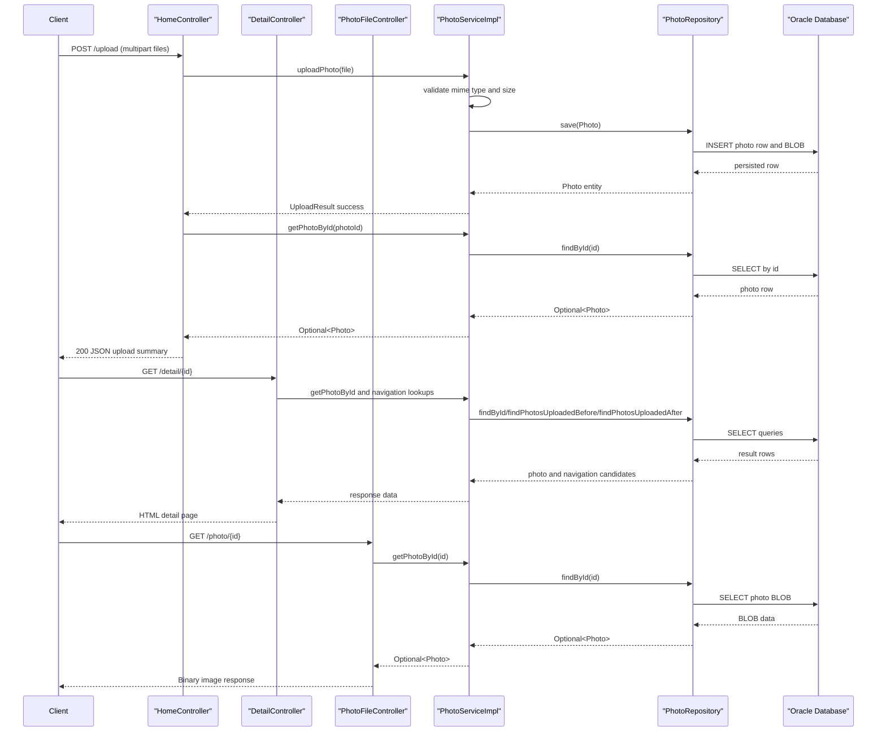

# API & Service Communication Contracts

The application exposes a compact HTTP surface for gallery rendering, image retrieval, upload, and deletion. Communication is synchronous and in-process, with no asynchronous broker-based messaging.

## Service Catalog

| Service | Port | Category | Purpose |
|---|---|---|---|
| photo-album (single Spring Boot app) | 8080 | API Layer + Business | Serves web pages and JSON upload responses; handles photo lifecycle operations |
| oracle-db (Docker Compose dependency) | 1521 | Infrastructure | Persistent storage for photo metadata and image BLOBs |

## API Endpoints Inventory

| Service | Method | Path | Request Type | Response Type |
|---|---|---|---|---|
| photo-album / HomeController | GET | / | None | HTML `index` view |
| photo-album / HomeController | POST | /upload | Multipart body (`files`: List<MultipartFile>) | JSON object with `success`, `uploadedPhotos`, `failedUploads` |
| photo-album / DetailController | GET | /detail/{id} | Path param `id` | HTML `detail` view or redirect |
| photo-album / DetailController | POST | /detail/{id}/delete | Path param `id` | Redirect to `/` with flash status |
| photo-album / PhotoFileController | GET | /photo/{id} | Path param `id` | Binary image resource with MIME type |

## Management & Observability Endpoints

| Service | Endpoint | Custom Metrics (if any) |
|---|---|---|
| photo-album | None explicitly configured | None detected |

## DTOs & Contracts

API request/response contracts are lightweight and mostly controller-local maps. `UploadResult` is the explicit service-level result DTO used to represent upload status (`success`, `fileName`, `errorMessage`, `photoId`). `Photo` acts as the domain entity and is used internally by controllers/services to compose view models and JSON snippets; no gateway-level aggregation DTOs are present. Serialization uses Spring Boot's default Jackson stack.

## Communication Patterns

Communication is synchronous REST-style HTTP between browser and controller endpoints. Controllers delegate to a single `PhotoService` implementation, which calls `PhotoRepository` for persistence. No asynchronous communication, service discovery, API gateway, circuit breaker, retry, or timeout policy frameworks are configured. Startup availability depends on Oracle database readiness (Docker Compose `depends_on` with health condition). Security posture: no API authentication, authorization, or TLS configuration is declared in the application; endpoints are publicly reachable within the deployed network context.

## Service Technology Matrix

| Service | Web | Data Access | Discovery | Gateway | Actuator | Cache | Metrics |
|---|---|---|---|---|---|---|---|
| photo-album | Spring MVC + Thymeleaf | Spring Data JPA (Oracle) | None | None | None | None | None |

## Service Communication Sequence

