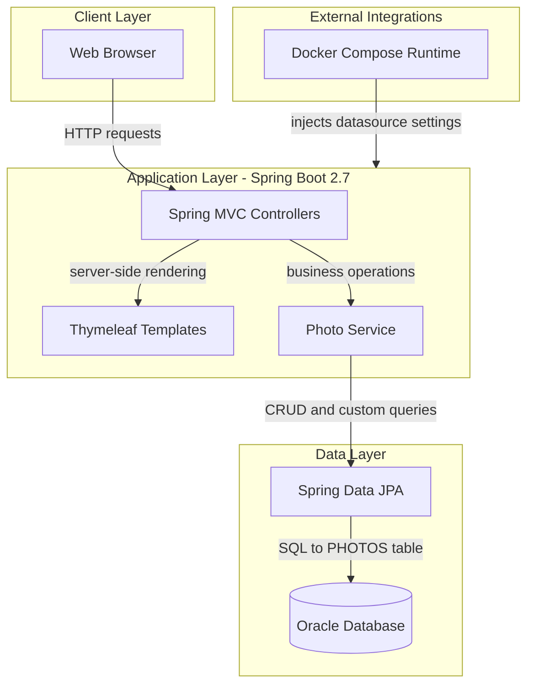
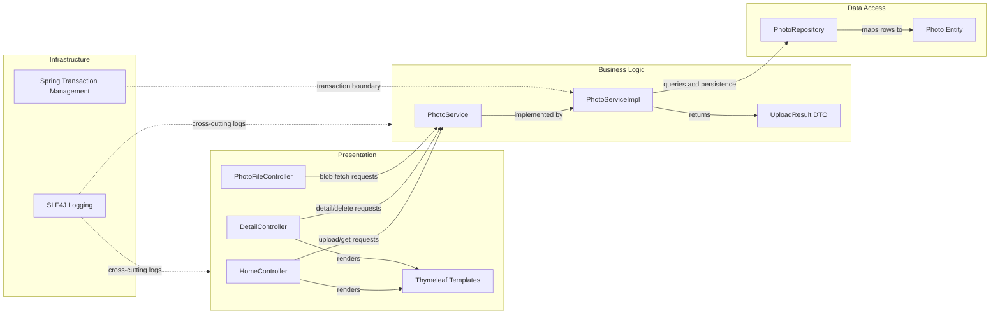

# Architecture Diagram

This document summarizes the current application architecture and the main component interactions for the Photo Album application.

## Application Architecture

### Technology Stack Summary

| Layer | Technology | Version | Purpose |
|---|---|---|---|
| Presentation | Spring MVC + Thymeleaf | Spring Boot 2.7.18 | Handles UI rendering and web request routing |
| Business Logic | Spring Service Layer | Spring Boot 2.7.18 | Validates uploads and orchestrates photo operations |
| Data Access | Spring Data JPA + Hibernate | Spring Boot 2.7.18 managed | Persists and retrieves photo metadata and BLOB data |
| Database | Oracle Database + ojdbc8 | Driver managed by Spring Boot parent | Stores photo records and binary photo content |
| Runtime | Java | 8 | Runs the application |

### Data Storage & External Services

The application persists all photo metadata and photo binary content in an Oracle database (`photos` table with a BLOB column). No cache, message broker, or external API integrations are defined. Docker Compose provides an Oracle container and injects runtime environment variables for the app container.

### Key Architectural Decisions

- Uses a monolithic Spring Boot MVC architecture with server-side rendered pages.
- Stores uploaded image bytes directly in Oracle BLOB storage instead of external object storage.
- Keeps business logic centralized in `PhotoServiceImpl`, with controllers focused on HTTP concerns.

## Component Relationships

### Component Inventory

| Component | Layer | Type | Responsibility |
|---|---|---|---|
| HomeController | Presentation | MVC Controller | Loads gallery and handles multi-file upload API |
| DetailController | Presentation | MVC Controller | Serves photo detail page and photo deletion flow |
| PhotoFileController | Presentation | MVC Controller | Streams photo bytes from DB to clients |
| PhotoService | Business Logic | Service Interface | Defines photo management operations |
| PhotoServiceImpl | Business Logic | Service Implementation | Validates files, extracts metadata, persists photo data |
| UploadResult | Business Logic | DTO | Represents upload result state for API responses |
| PhotoRepository | Data Access | Spring Data Repository | Executes CRUD and Oracle-specific native queries |
| Photo | Data Access | JPA Entity | Represents persisted photo metadata and binary payload |
| Spring Transaction Management | Infrastructure | Cross-cutting concern | Controls transactional consistency in service operations |
| SLF4J Logging | Infrastructure | Cross-cutting concern | Captures operational and error logs |
