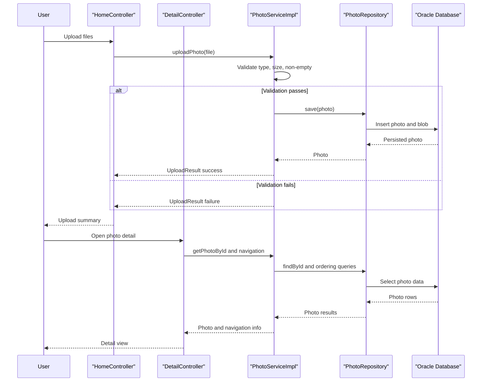

# Core Business Workflows

The application supports a simple photo management domain where users upload, browse, view, and delete personal images. Business behavior centers on upload validation, storage, and gallery navigation.

## Domain Entities

| Entity | Service / Bounded Context | Description | Key Relationships |
|---|---|---|---|
| Photo | Photo Management | Represents a user-uploaded image and display metadata | Central aggregate used by upload, gallery listing, detail viewing, and deletion |
| UploadResult | Photo Management | Represents upload outcome for API response shaping | Produced by upload flow and consumed by upload endpoint response builder |

## Service-to-Domain Mapping

| Service | Domain Context | Owned Entities | External Dependencies |
|---|---|---|---|
| photo-album (Spring Boot app) | Photo Management | Photo, UploadResult | Oracle database |

## Primary Workflows

### Workflow 1: Upload Photos

1. User submits one or more files to `POST /upload`.
2. Controller iterates each file and delegates to `PhotoService.uploadPhoto`.
3. Service enforces upload rules (allowed MIME types, max size, non-empty file).
4. Service reads image bytes, derives dimensions, persists photo record.
5. Controller composes JSON response with uploaded and failed file lists.

Business rules involved: allowed image MIME types only, max upload size, non-empty content requirement.

### Workflow 2: View Gallery and Photo Detail

1. User opens `/` to load all photos sorted by latest upload time.
2. User opens `/detail/{id}` for full-size detail view.
3. Service retrieves target photo plus previous and next photos for navigation.
4. User browser requests `/photo/{id}` to fetch binary image bytes for rendering.

Business rules involved: missing or invalid IDs redirect to gallery; navigation based on upload timestamp ordering.

### Workflow 3: Delete Photo

1. User submits `POST /detail/{id}/delete`.
2. Service verifies existence and deletes the photo record.
3. Controller sets success/failure flash status and redirects to gallery.

Business rules involved: deletion only succeeds for existing photo identifiers.

## Cross-Service Data Flows

No multi-service composition is implemented. All data needed for workflows is sourced from the same service and Oracle database. There is no fallback composition path because there are no downstream service calls.

## Business Workflow Sequence

## Business Rules & Decision Logic

- Upload validation rules enforce MIME-type allowlist, file-size limit, and non-empty file content.
- Gallery and detail navigation are governed by upload timestamp ordering (older/newer lookup).
- Delete operation checks entity existence before mutation and returns user-facing status.
- Transaction boundaries are managed at service level via `@Transactional`.
- Error paths return safe outcomes (failed upload entries, redirects, or 404/500 responses for binary retrieval).
