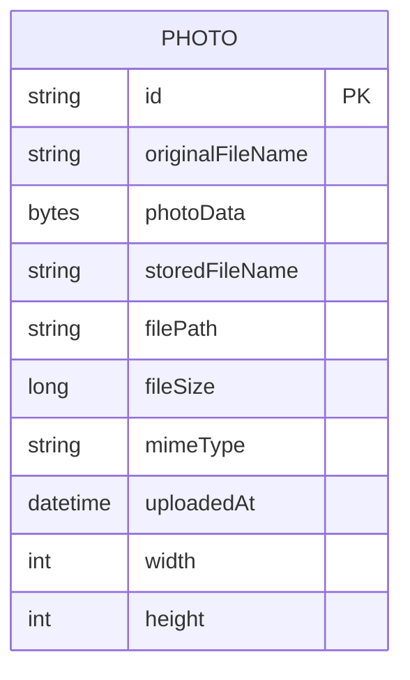

# Data Architecture & Persistence Layer

This project uses a single relational data model centered on one JPA entity stored in Oracle, with Spring Data JPA as the persistence abstraction. The data layer is simple and monolithic with no distributed ownership split.

## Database Configuration

| Service/Module | DB Type | Profile | Driver | Connection | Migration Tool |
|---|---|---|---|---|---|
| photo-album | Oracle | default | oracle.jdbc.OracleDriver | jdbc:oracle:thin:@oracle-db:1521/FREEPDB1 | None detected |
| photo-album | Oracle | docker | oracle.jdbc.OracleDriver | jdbc:oracle:thin:@oracle-db:1521:XE (overridden in compose env to FREEPDB1) | None detected |
| tests | H2 (test dependency) | test scope | org.h2.Driver (via dependency) | in-memory during tests | None detected |

## Data Ownership per Service

| Service | Tables Owned | ORM Framework | Caching | Notes |
|---|---|---|---|---|
| photo-album | PHOTOS | Spring Data JPA / Hibernate | None | Single-service ownership; photo bytes stored directly in table BLOB column |

## Entity Model

## Key Repository Methods

| Service | Repository | Notable Methods | Purpose |
|---|---|---|---|
| photo-album | PhotoRepository (`src/main/java/com/photoalbum/repository/PhotoRepository.java`) | `findAllOrderByUploadedAtDesc()` | Loads gallery photos newest first |
| photo-album | PhotoRepository | `findPhotosUploadedBefore(LocalDateTime)` | Supports previous-photo navigation |
| photo-album | PhotoRepository | `findPhotosUploadedAfter(LocalDateTime)` | Supports next-photo navigation |
| photo-album | PhotoRepository | `findPhotosByUploadMonth(String, String)` | Oracle-specific month-based lookup |
| photo-album | PhotoRepository | `findPhotosWithPagination(int, int)` | Oracle `ROWNUM` based pagination |
| photo-album | PhotoRepository | `findPhotosWithStatistics()` | Oracle analytical query for ranking and running totals |

## Caching Strategy

No cache provider or cache annotations are configured. The application serves all reads directly from Oracle through repository calls.

## Data Ownership Boundaries

Data topology is a single shared store owned by a single service. There are no cross-service data access patterns, no CQRS split, and no inter-service aggregation queries.

### Data Classification & Sensitivity

| Entity | Sensitive Fields | Classification (PII/PHI/PCI/None) | Controls in Place |
|---|---|---|---|
| Photo | `originalFileName`, `photoData` (user-uploaded image content) | PII (potential), None explicit for PHI/PCI | No field-level masking or encryption settings detected in application config |

