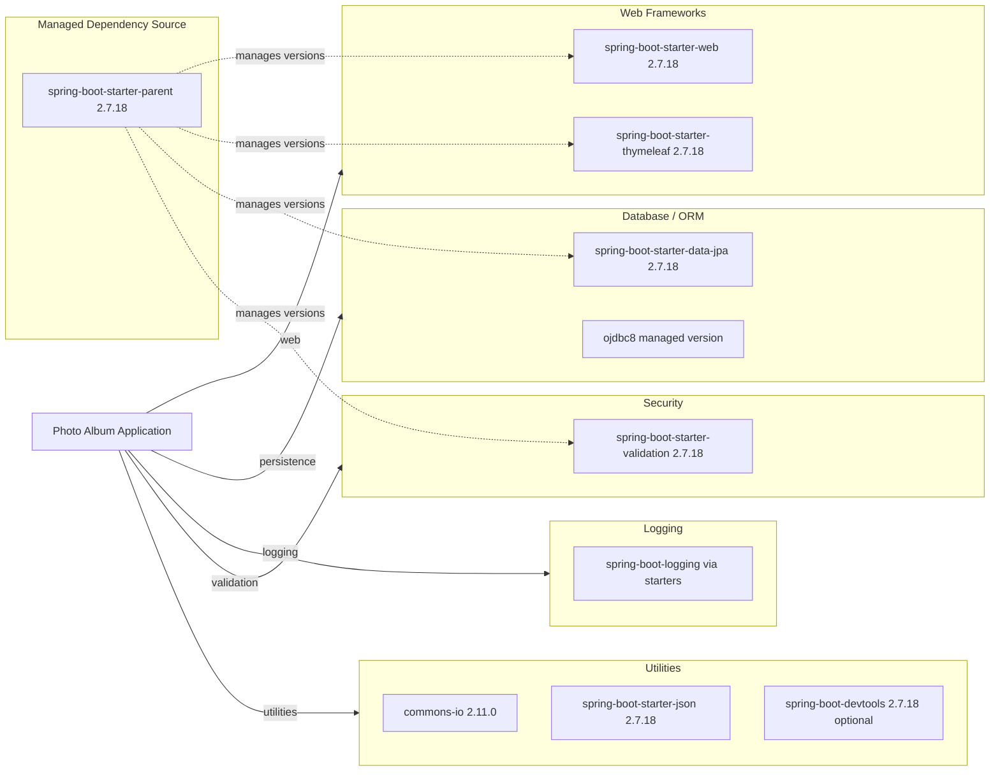

# Dependency Map

This document maps declared dependencies for Photo Album from its Maven build configuration. The project declares 8 non-test dependencies and 2 test-scope dependencies.

## Dependencies

### Dependency Summary

| Category | Count | Key Libraries | Notes |
|---|---:|---|---|
| Web Frameworks | 2 | spring-boot-starter-web, spring-boot-starter-thymeleaf | MVC and server-side rendering |
| Database / ORM | 2 | spring-boot-starter-data-jpa, ojdbc8 | Oracle-focused persistence stack |
| Logging | 1 | spring-boot logging stack | Pulled transitively through starters |
| Security | 1 | spring-boot-starter-validation | Input validation, not authentication/authorization |
| Utilities | 3 | commons-io, spring-boot-starter-json, spring-boot-devtools | File IO, JSON handling, developer tooling |

### Version & Compatibility Risks

The application targets Java 8 and Spring Boot 2.7.18, which is an older baseline for modernization efforts. Oracle-specific native SQL and Oracle JDBC runtime coupling can increase migration effort when moving to managed cloud database services.

### Notable Observations

- Dependency versions are mostly governed by Spring Boot parent POM, simplifying coordinated upgrades.
- `commons-io` is pinned to an explicit version while most others are parent-managed.
- No dedicated observability dependency (for example Micrometer Prometheus registry) is declared.
- No messaging or distributed cache dependency is declared.

## Test Dependencies

| Framework | Version | Notes |
|---|---|---|
| spring-boot-starter-test | 2.7.18 managed | Primary testing bundle (JUnit, assertions, Spring test support) |
| h2 | managed by Spring Boot parent | In-memory test database |

Total test-scope dependencies: 2

Test infrastructure is minimal and focused on Spring Boot defaults with an in-memory database for test execution.
